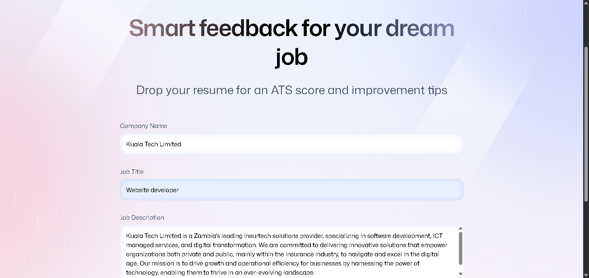
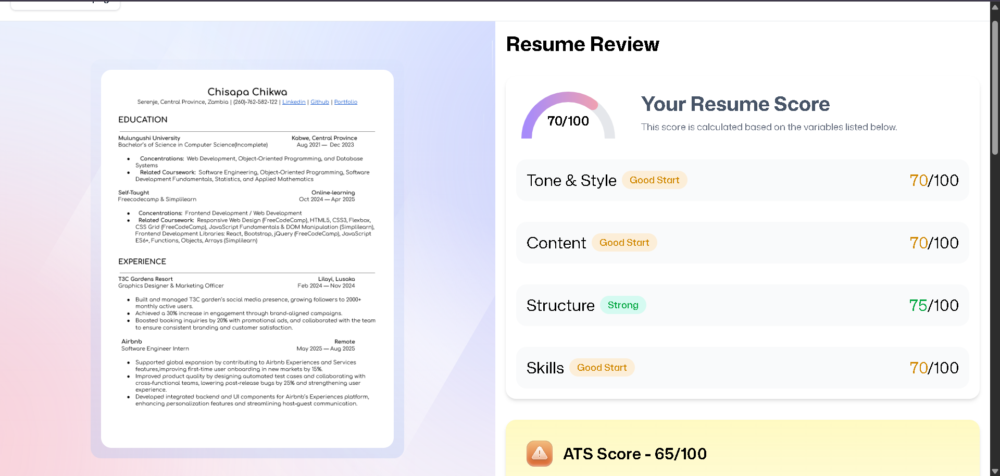

# AI Resume Analyzer

AI-powered resume analysis and job matching built with **React + TypeScript**. Upload and store multiple resumes, paste a job description, and get an **ATS-style score** plus targeted feedback to improve alignment—all handled in the browser using **Puter.js** (no custom backend required).

---

## Demo

- **Live Demo:** https://ai-resume-aw2w0mmcn-chikwa235s-projects.vercel.app/

## Screenshots

  


---

## Features

- **Browser-only authentication** with **Puter.js** (no backend setup)
- **Resume upload & storage** so users can keep multiple versions in one place
- **AI resume matching** against a job listing with:
  - **ATS-style score**
  - **Actionable feedback** tailored to the listing
- **Reusable UI components** and clean, maintainable layout
- **Responsive UI** (mobile → desktop)
- Built with a modern stack: fast dev server, type-safety, and simple state management

---

## Tech Stack

- **React** — component-based UI
- **React Router v7** — routing (nested routes, data loaders/actions, error boundaries)
- **TypeScript** — static typing for maintainability
- **Vite** — fast development + optimized builds
- **Tailwind CSS** — utility-first styling
- **shadcn/ui** — modern UI primitives
- **Zustand** — minimal global state management
- **Puter.js / Puter** — client-side auth, storage, and AI APIs (user-billed, serverless)

---

## How It Works

1. User signs in via **Puter**
2. User uploads a resume (stored in **Puter storage**)
3. User pastes a job description (or job listing text)
4. The app runs an AI evaluation to generate:
   - an **ATS-style score**
   - **feedback and improvement suggestions**
5. Results can be viewed and re-run for different resumes/listings

---

## Notes on Scoring & AI Output

- The **ATS score is a heuristic** meant to help users iterate quickly—it’s not an official score from any specific ATS vendor.
- AI feedback quality depends on the clarity of:
  - the resume content
  - the job description provided
- Avoid including highly sensitive personal information in resumes you upload.

---

## Project Setup (Local)

### Prerequisites

Make sure you have:
- **Git**
- **Node.js**
- **npm**

### Installation

```bash
npm install

Run the frontend
npm run dev

Open your terminal and navigate to the backend folder:
cd server

Install dependencies (only needed the first time):
npm install

Start the backend server:
node index.js

Project Structure
.
├── public/                 # static assets (icons, images, pdf worker, etc.)
├── src/                    # app source code
│   ├── components/         # reusable UI components
│   ├── pages/              # route-level pages
│   ├── routes/             # router config (React Router)
│   ├── store/              # zustand stores
│   ├── lib/                # puter helpers, utils, API wrappers
│   ├── styles/             # global styles (if used)
│   └── main.tsx
├── types/                  # shared TypeScript types
├── server/                 # backend code
├── package.json
├── vite.config.ts
└── README.md

Credits
Puter / Puter.js — auth, storage, AI APIs
Tailwind CSS + shadcn/ui — UI styling and components


License
MIT License © chisapa chikwa

